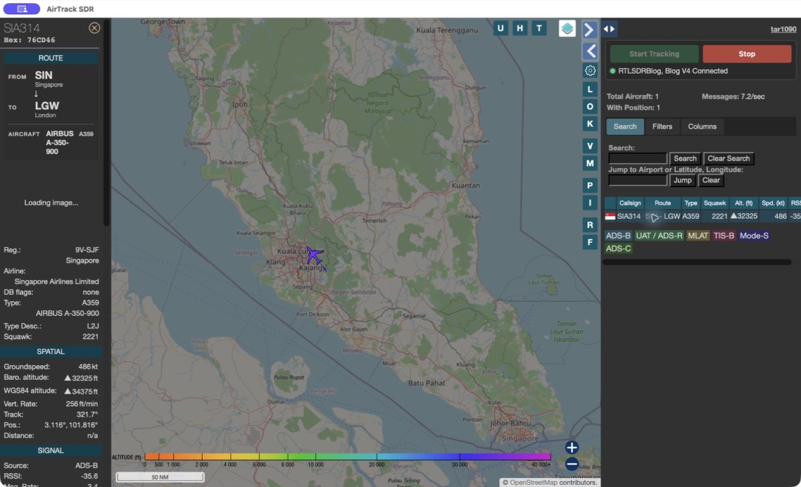

# AirTrack SDR

AirTrack SDR is a one-click ADS-B aircraft map for macOS. Connect a supported USB software-defined radio, open the app, and select **Start Tracking**. No Homebrew, Python, Terminal commands, or browser configuration is required.



## Highlights

- Automatic USB SDR discovery and one-device auto-selection
- Device picker appears only when multiple compatible receivers are attached
- Live aircraft map, icons, tracks, altitude, speed, callsign, route, and aircraft model
- English-only user interface
- Automatic gain settings suitable for first-time users
- Local decoder control with clear Start and Stop actions
- Apple Silicon and Intel release builds
- Local aircraft database; route lookup uses the internet when available

## Supported hardware

AirTrack SDR v1.0 supports hardware accepted by its bundled FlightAware dump1090 decoder:

- RTL-SDR Blog V3 and V4
- Generic RTL2832U receivers using R820T, R820T2, R828D, or compatible tuners
- Nooelec NESDR models based on RTL2832U
- Nuand bladeRF devices supported by `libbladeRF`

Airspy, SDRplay, HackRF, LimeSDR, and Funcube Dongle are detected as unsupported in v1.0 because the bundled decoder does not provide a compatible input backend for them. This is intentional: the app never claims compatibility it cannot validate.

## Requirements

- macOS 13 Ventura or later
- A supported SDR receiver
- A 1090 MHz antenna for useful ADS-B range
- Internet access for map tiles, aircraft photos, and route lookup

## Installation

1. Download the DMG for your Mac from GitHub Releases.
2. Drag **AirTrack SDR** to **Applications**.
3. Connect the SDR and antenna.
4. Open AirTrack SDR and select **Start Tracking** if it has not started automatically.

Unsigned community builds may require right-clicking the app and choosing **Open** once. Officially notarized builds require an Apple Developer ID and are identified in their release notes.

## Privacy

Aircraft decoding and device control happen locally. AirTrack SDR sends observed callsigns and aircraft positions to the configured route service (`adsb.im`) only to resolve origin and destination. Standard map and aircraft-photo providers receive normal web requests when their features are displayed.

The local control server binds only to `127.0.0.1` and chooses an available port between 8090 and 8190.

## Build from source

Install the build dependencies:

```bash
brew install dump1090-fa librtlsdr libbladerf libusb ncurses
./scripts/build-macos.sh
./scripts/verify-bundle.sh
```

The DMG and checksum are written to `dist/`.

## Troubleshooting

- **No Supported SDR Device Found** — reconnect the USB receiver directly, avoid unpowered hubs, and reopen the app.
- **Unable to Open SDR — It May Be in Use** — close Gqrx, SatDump, SDR++, or any other app using the same receiver.
- **No aircraft** — place the antenna vertically near a window and wait several minutes. ADS-B reception depends on line of sight.
- **Map works but routes do not** — route lookup requires internet access and may not identify private, military, or irregular callsigns.

## License

AirTrack SDR is distributed under GPL-2.0-or-later. It contains modified tar1090 code and bundled GPL-compatible receiver components. See [THIRD_PARTY_NOTICES.md](THIRD_PARTY_NOTICES.md).
